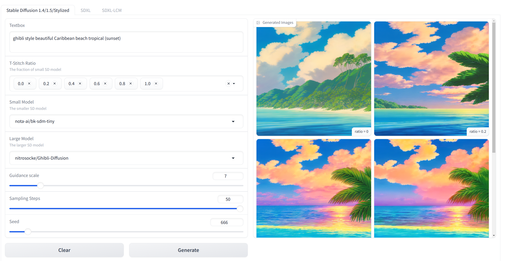
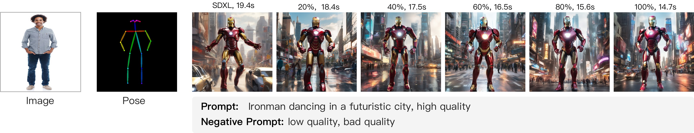

# 🖇 T-Stitch: Accelerating Sampling in Pre-trained Diffusion Models with Trajectory Stitching

This is the official PyTorch implementation of T-Stitch: Accelerating Sampling in Pre-trained Diffusion Models with Trajectory Stitching

>  [Zizheng Pan](https://zizhengpan.github.io/)<sup>1</sup>, [Bohan Zhuang](https://bohanzhuang.github.io/)<sup>1</sup>, [De-An Huang](https://ai.stanford.edu/~dahuang/)<sup>2</sup>, [Weili Nie](https://weilinie.github.io/)<sup>2</sup>, [Zhiding Yu](https://chrisding.github.io/)<sup>2</sup>, [Chaowei Xiao](https://xiaocw11.github.io/)<sup>2,3</sup>, [Jianfei Cai](https://jianfei-cai.github.io/)<sup>1</sup>, [Anima Anandkumar](http://tensorlab.cms.caltech.edu/users/anima/) <sup>4</sup>
>
>  Monash University<sup>1</sup>, NVIDIA<sup>2</sup>, University of Wisconsin, Madison<sup>3</sup>, Caltech<sup>4</sup>
>
>  [[Paper]()] [[Project Page](https://t-stitch.github.io/)]


## 📰 A Gentle Introduction

We introduce sampling Trajectory Stitching (**T-Stitch**), a simple yet efficient technique to improve the generation efficiency with little or no loss in the generation quality. Instead of solely using a large DPM for the entire sampling trajectory, T-Stitch first leverages a smaller DPM in the initial steps as a cheap drop-in replacement of the larger DPM and switches to the larger DPM at a later stage, thus achieving flexible speed and quality trade-offs.


One example of stitching more DiT-S steps to achieve faster sampling for DiT-XL, where the time cost is measured by generating 8 images on one RTX 3090 in seconds (s).


By directly adopting a small SD in the model zoo, T-Stitch naturally interpolates the speed, style, and image contents with a large styled SD, which also potentially improves the prompt alignment, e.g., “New York City” and “tropical beach” in the above examples.


T-Stitch is completely complementary to previous techniques that focus on reducing the sampling steps, e.g., directly reduce the number of steps, advanced samplers, distillation.


## 🛠 Setup

For basic usage with diffusers, you can create an environment following our provided `requirements.txt`. Create a conda environment and activate it

```bash
conda create -n tstitch python=3.9 -y
conda activate tstitch
pip install -r requirements.txt
```

## 🪄 Gradio Demo





```bash
python gradio_demo.py
```


## ⚙️ DiT Experiments

Please refer to the folder [dit](./dit) for detailed usage.


## ⚙️ U-Net Experiments

Please refer to the folder [ldm](./ldm) for detailed usage.


## ⚙️ Stable Diffusion Experiments

Using T-Stitch for stable diffusion models is easy. At the root of this repo, do

```python
import torch
from tstitch_sd_utils import get_tstitch_pipepline
import os

large_sd = "Envvi/Inkpunk-Diffusion"
small_sd = "nota-ai/bk-sdm-tiny"

pipe_sd = get_tstitch_pipepline(large_sd, small_sd)
prompt = 'a squirrel in the park, nvinkpunk style'
latent = torch.randn(1, 4, 64, 64, device="cuda", dtype=torch.float16)

save_dir = f'figures/inkpunk'
if not os.path.exists(save_dir):
    os.makedirs(save_dir)

ratios = [round(item, 1) for item in torch.arange(0, 1.1, 0.1).tolist()]
for ratio in ratios:
    image = pipe_sd(prompt, unet_s_ratio=ratio, latents=latent, height=512, width=512).images[0]
    image.save(f"{save_dir}/sample-ratio-{ratio}.png")
```

The above script will create images by gradually increasing the fraction of small sd at the early sampling steps. Please feel free to try other stylized SD and other prompts. Also note that both models are required to process latents of the same shape. 


### Accelerating SDXL

T-Stitch provides a smooth speed and quality trade-off between a compressed SSD-1B and the original SDXL. Try the following command for this demo,

```bash
python sdxl_demo.py
```


### Accelerating SDXL + ControlNet
T-Stitch is compatible with Controlnet, for example,

To use canny edges with SDXL, run `python sdxl_canny.py`


To use depth images with SDXL, run `python sdxl_depth.py`


To use poses with SDXL, run `python sdxl_pose.py`




### Accelerating SDXL + LCM

T-Stitch is compatible with step-distilled models such as LCM-SDXL to achieve further speedup. For example, by adopting a small LCM distilled SSD-1B, T-Stitch still obtains impressive speed and quality trade-offs. We provide a script to demonstrate this compatibility.

```bash
python sdxl_lcm_lora.py
```


## Acknowledgments

Thanks to the open source codebases such as [DiT](https://github.com/facebookresearch/DiT),  [ADM](https://github.com/openai/guided-diffusion),  [Diffusers](https://github.com/huggingface/diffusers) and [LDM](https://github.com/CompVis/latent-diffusion). Our codebase is built on them. 


## License

T-Stitch is licensed under CC-BY-NC. See [LICENSE.txt](./LICENSE.txt) for details. Portions of the project are available under separate license terms: [LDM](https://github.com/CompVis/latent-diffusion) is licensed under the [MIT License](https://github.com/CompVis/latent-diffusion/blob/main/LICENSE).