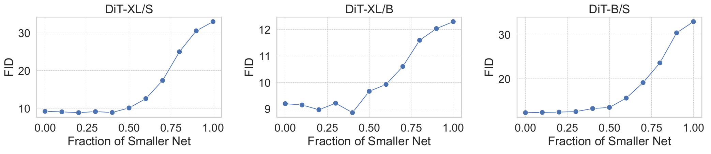
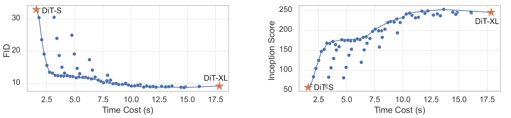
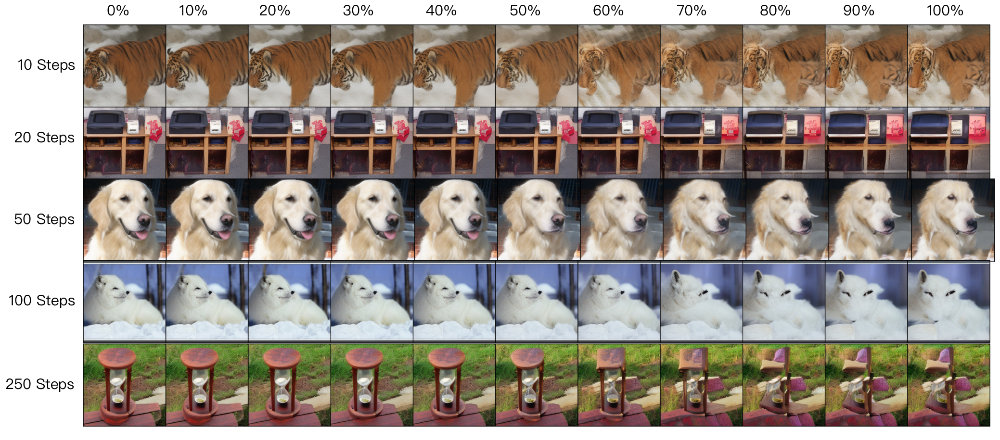

# T-Stitch for DiT Experiments


## Setup

1. Preparing a conda env according to the official repo of [DiT](https://github.com/facebookresearch/DiT). 
2. Download pretrained DiT weights and put into `./pretrained_models`. The tree structure for this folder should be 
   ```
   pretrained_models/
   ├── dit_b_256.pt
   ├── dit_s_256.pt
   ├── dit_xl_256.pt
   └── readme.txt
   ```

## Pretrained DiT

| Model  | Resolution | Params (M) | FLOPs (G) | Time Cost (s) | FID-5K | Weights                                                      |
| ------ | ---------- | ---------- | --------- | ------------- | ------ | ------------------------------------------------------------ |
| DiT-S  | 256x256    | 33         | 5         | 1.6           | 33.46  | [google_drive](https://drive.google.com/file/d/1YOSNrFbP36vHlPQPBosqZKbPLokymRuO/view?usp=sharing) |
| DiT-B  | 256x256    | 131        | 22        | 4.0           | 12.30  | [google_drive](https://drive.google.com/file/d/1HTqZSYXh6LJGLooko4LPFsCuwL2Wjg6r/view?usp=sharing) |
| DiT-XL | 256x256    | 675        | 114       | 16.5          | 9.2    | [google_drive](https://drive.google.com/file/d/1GxoI7SmIQLJoeQp25LK9zA1YFGJiRXO1/view?usp=sharing) |

> Time cost is measured by generating 8 images on a single RTX 3090.

## Sampling

To sample images with a specific fraction of DiT-S, e.g., 50% early steps are taken by DiT-S,

```bash
python sample_t_stitch.py   --solver ddim  --num-sampling-steps 100 --seed 4 --ratio 0.5
```


To sample images with all trade-offs between 0.0 and 1.0 fractions of DiT-S,

```bash
python sample_t_stitch.py   --solver ddim  --num-sampling-steps 100 --seed 4 --all_tradeoffs
```


To sample images by using three models based on a fraction configuration, e.g., DiT-S : DiT-B : DiT-XL  = 40% : 40% : 20%

```
python sample_t_stitch.py   --solver ddim  --num-sampling-steps 100 --seed 4 --three_combo 0.4 0.2 0.4
```


## FID Evaluation

We provide scripts for evaluating FID of all trade-offs based on two model combo,

```bash
torchrun --nnodes=1 --nproc_per_node=8 sample_ddp_t_stitch.py --num-fid-samples 5000  --solver ddim  --num-sampling-steps 100
```

For three model combo, 

```bash
torchrun --nnodes=1 --nproc_per_node=8 sample_ddp_t_stitch.py --num-fid-samples 5000  --solver ddim  --num-sampling-steps 100 --three_combo
```

After generation, evaluting FID of each npz by

```bash
python evaluator.py assets/fid_stats/VIRTUAL_imagenet256_labeled.npz samples/[file_name].npz
```


## Results

### Two models combo



### Three models combo



### Image Samples



More samples can be found in our appendix.


## Acknowledgments

The DiT experiments are built upon [DiT](https://github.com/facebookresearch/DiT). We thank the authors for releasing their code.