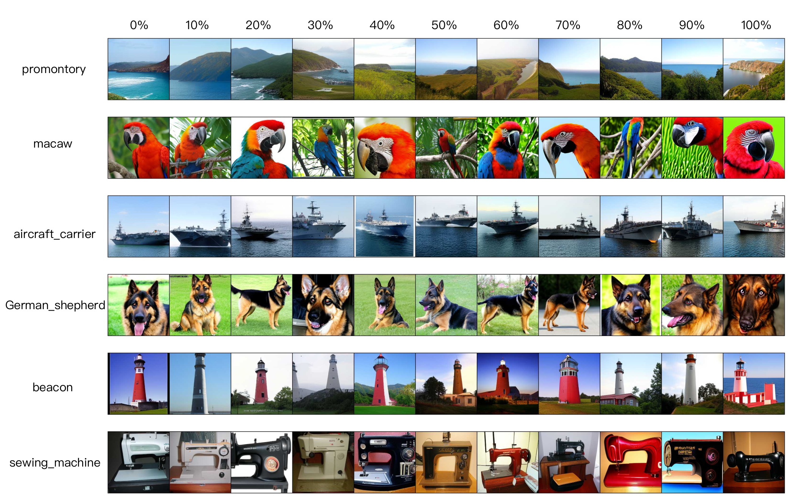

# T-Stitch for U-Net Experiments


## Setup

1. Install additional packages according to the official repo of [LDM](https://github.com/CompVis/latent-diffusion).

   ```bash
   pip install -r requirements.txt
   ```

2. Download the pretrained [LDM unets](https://drive.google.com/drive/folders/1zM3W1uVvGEgEyve7oMPgRaXHs06O6mjJ?usp=sharing) and [vq-f8](https://ommer-lab.com/files/latent-diffusion/vq-f8.zip). Then putting into `pretrained_models/`. The tree structure for this folder should be 
   
   ```
   pretrained_models
   ├── ldm.ckpt
   ├── ldm_s.ckpt
   ├── readme.txt
   └── vq-f8
       └── model.ckpt
   ```

## Pretrained LDMs

| Model | Param (M) | Train Iter | Time Cost (s) | FID-5K | Weights                                                      |
| ----- | --------- | ---------- | ------------- | ------ | ------------------------------------------------------------ |
| LDM-S | 25        | 400K       | 2.9           | 40.92  | [google_drive](https://drive.google.com/file/d/1HgKfkIHr14O8HjIf-RCw8cLEdsbn2h9h/view?usp=sharing) |
| LDM   | 394       | 200K       | 7.1           | 20.11  | [google_drive](https://drive.google.com/file/d/1YRnLZuR8xIS9GgtU7a_sTTH5G2KkJk7s/view?usp=sharing) |

## Usage

To sample images with a specific fraction of the small denoiser

```bash
python scripts/sample_imagenet_32_t_stitch.py --ratio 0.5 --sampling-steps 100 --cfg-scale 3.0
```

The generated images are located at `./figures`

To sample images with all fractions between 0.0 and 1.0

```bash
python scripts/sample_imagenet_32_t_stitch.py --all_ratios --sampling-steps 100 --cfg-scale 3.0
```

## FID Evaluation

Distributed sampling with T-Stitch under a specific fraction of the small denoiser

```bash
python -m torch.distributed.launch --nproc_per_node=8 \
      --master_port 1236 \
      --use_env scripts/sample_imagenet_ddp_t_stitch.py \
      --num-fid-samples 5000 \
      --num-sampling-steps 100 --cfg-scale 3.0 --ratio 0.5
```

The above command will produce a `.npz` file under `samples/`. Next, to evaluate the FID, sFID, Inception Score, Precision and Recall

```bash
python evaluator.py assets/fid_stats/VIRTUAL_imagenet256_labeled.npz samples/[file_name].npz
```


## Results

| Fraction of LDM-S | 0      | 0.1    | 0.2    | 0.3    | 0.4    | 0.5    | 0.6    | 0.7    | 0.8   | 0.9   | 1     |
| ----------------- | ------ | ------ | ------ | ------ | ------ | ------ | ------ | ------ | ----- | ----- | ----- |
| FID-5K            | 20.11  | 19.54  | 18.74  | 18.64  | 18.60  | 19.33  | 21.81  | 26.03  | 30.41 | 35.24 | 40.92 |
| Inception Score   | 199.24 | 201.87 | 202.81 | 204.01 | 193.62 | 175.62 | 140.69 | 110.81 | 90.24 | 70.91 | 54.41 |
| Speed (s)         | 7.1    | 6.7    | 6.2    | 5.8    | 5.3    | 4.9    | 4.5    | 4.1    | 3.6   | 3.1   | 2.9   |


## Image Samples



More samples can be found in our appendix.


## Acknowledgments

The U-Net experiments are built upon [latent-diffusion](https://github.com/CompVis/latent-diffusion). We thank the authors for releasing their code.